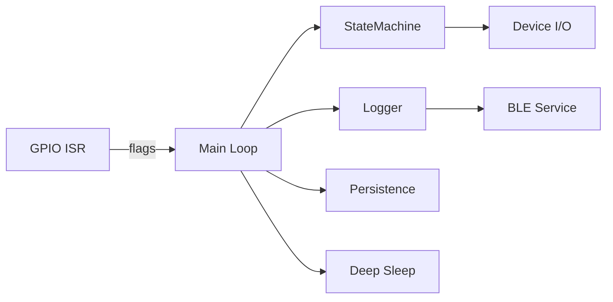

# Vetra Firmware (ESP32-C3)

Built by Adeesh Devanand.

A production-grade embedded firmware for an ESP32-C3–based device that monitors and controls a heating coil with debounced input sensing, puff-count state management, logging over BLE, and deep-sleep lifecycle handling. Designed for engineers building reliable, low-power, BLE-enabled hardware.

---

## Demo / Screenshots



---

## Key Features

- Input debouncing for noisy GPIO signals (e.g., button/heat pin).
- Puff counting via a finite state machine with configurable phase durations.
- BLE service for log streaming/diagnostics.
- Deep-sleep entry/exit with external GPIO wake support.
- Persistent storage of epoch for time restore on boot.
- Structured logging via in-memory ring buffer.
- Minimal ISR pattern using volatile flags to avoid watchdog resets.

### Engineering Highlights

- ESP32-C3 + Arduino framework with PlatformIO-based build and testing.
- Clear separation of concerns: ISR → flags, loop → state/logic.
- Compile-time tunables via `build_flags` for deterministic behavior.
- Defensive logging and state transitions to minimize runtime surprises.
- Unit-test scaffolding for core modules (state machine, device, BLE).

---

## How It Works

- GPIO interrupt on `HEAT_PIN` sets lightweight volatile flags (no heavy work in ISR).
- The main loop polls a DebounceManager and drains ISR flags atomically.
- Rising/falling events feed the `StateMachine`, which manages puff counting phases.
- `Device` module locks/unlocks the coil based on the current state.
- Logs are buffered and exposed via `BLEManager` for external inspection.
- When idle or timed out, the firmware records the current epoch and enters deep sleep.
- On wake, time is restored from persistent storage when needed.

### Architecture / Components

- `src/App.cpp`: Application lifecycle, ISR flags, event handling, deep sleep.
- `src/Device.cpp`: Hardware pin setup, coil control (lock/unlock).
- `lib/StateMachine/`: Puff counting state machine and transitions.
- `lib/BLE/`: BLE service wrappers and log exposure.
- `lib/Logger/`: Ring buffer logging and formatted output helpers.
- `lib/Utils/Debounce.*`: Debounce manager for noisy inputs.
- `lib/Utils/PersistenceManager.*`: Persist/restore epoch and settings.
- `lib/Utils/Timer.*`: Lightweight timing utilities for phases.

Design decisions:
- Keep ISRs minimal and IRAM-safe: set flags only; all logic runs in the loop.
- Use compile-time macros for tunables to avoid runtime config complexity.
- Prefer deep sleep over light sleep for predictable power behavior.

---

## Tech Stack

- Language: C++17
- MCU/Platform: ESP32-C3 (`esp32-c3-devkitm-1`)
- Framework: Arduino
- Build/Test: PlatformIO
- Major modules: BLE, StateMachine, Logger, Debounce, Persistence, Timer

---

## Prerequisites

- OS: Windows, macOS, or Linux
- Tools:
  - VS Code (recommended) + PlatformIO extension; or
  - PlatformIO Core (`pio`) via Python/pip
- Toolchains/SDKs:
  - Espressif32 platform via PlatformIO
- Hardware:
  - ESP32-C3 DevKitM-1 (USB connection)
  - Correct USB-UART drivers installed

---

## Installation

### Clone

```bash
git clone <REPO_URL>
cd Vetra
```

### Setup PlatformIO (CLI)

```bash
pip install -U platformio
pio platform install espressif32
```

Alternatively, install the "PlatformIO IDE" extension in VS Code and open this folder.

### Environments

This project defines two PlatformIO environments in `platformio.ini`:
- `env:vetra-dev`: development build with tuning flags
- `env:vetra-release`: release build with default flags

---

## Run / Usage

### Quickstart (Build / Upload / Monitor)

```bash
# Build
pio run -e vetra-dev

# Upload firmware
pio run -e vetra-dev -t upload

# Open serial monitor (115200 baud)
pio device monitor -b 115200
```

On Windows `cmd.exe`, the same commands apply:

```cmd
pio run -e vetra-dev
pio run -e vetra-dev -t upload
pio device monitor -b 115200
```

### Typical Flow

- Connect the ESP32-C3 via USB.
- Build and upload using `vetra-dev`.
- Observe logs over serial or BLE (when a BLE central connects to the service).
- Trigger the `BUTTON_PIN`/`HEAT_PIN` to exercise puff counting and deep-sleep wake.

---

## Configuration

Configuration is primarily via `platformio.ini` `build_flags`:

- `LOG_LEVEL` (required): integer log verbosity (e.g., `2`).
- `MAX_PUFFS` (optional): upper limit of puffs per session.
- `PHASE_DURATION_SECONDS` (optional): duration of a puff-counting phase.
- `NUM_PHASES` (optional): number of phases in a session.
- `MIN_PUFF_DURATION_MILLISECONDS` (optional): minimum time to qualify a puff.

Example (`env:vetra-dev`):

```ini
build_flags =
    -DUNITY_OUTPUT_COLOR
    -std=c++17
    -Wall
    -Wextra
    -Werror
    -DLOG_LEVEL=2
    -DMAX_PUFFS=10
    -DPHASE_DURATION_SECONDS=180
    -DNUM_PHASES=20
    -DMIN_PUFF_DURATION_MILLISECONDS=500
```

Note: Review pin assignments and wake configuration in code (`Device::setupPins`, deep-sleep wake setup in `App::setup`).

---

## Testing

Tests are located under `test/` (`test_ble_manager.cpp`, `test_device.cpp`, `test_sleep_manager.cpp`, `test_state_machine.cpp`).

Current `platformio.ini` uses `test_ignore` for these files in both environments. To run tests:

```bash
# Option A: Temporarily remove entries from test_ignore for your target env
# Option B: Create a dedicated test environment in platformio.ini and run:
pio test -e <your-test-env>
```

Next improvements:
- Add a CI-friendly test environment (no `test_ignore`).
- Use Unity/Catch2 consistently and assert critical state transitions.

---

## Troubleshooting

- Build fails with "unknown option or stray quote": Check `build_flags` for typos (e.g., stray `"`).
- Upload fails / no COM port:
  - Install ESP32-C3 USB-UART drivers; verify device in Device Manager (Windows) or `ls /dev/tty*` (macOS/Linux).
- Serial monitor shows gibberish: Ensure baud rate matches `monitor_speed` (115200).
- Watchdog resets / crashes on ISR:
  - Keep ISR minimal (set flags only); move logging and debounce to the main loop.
- Deep sleep never wakes:
  - Verify `esp_deep_sleep_enable_gpio_wakeup` pin and level match hardware; check pull-ups/downs.
- BLE not discoverable:
  - Ensure BLE service is started; test with a known BLE scanner; check power and advertising interval.
- Permission errors on macOS/Linux:
  - Add user to dialout group (Linux) or grant serial permissions.
- PlatformIO not found:
  - Install via `pip install -U platformio` or VS Code extension; restart terminal/editor.

---

## Project Structure

```
ISSUES.md
LICENSE
platformio.ini
README.md
include/
lib/
  BLE/
    BLEManager.cpp
    BLEManager.h
  Logger/
    LogBuffer.cpp
    LogBuffer.h
    Logger.cpp
    Logger.h
  StateMachine/
    StateMachine.cpp
    StateMachine.h
  Utils/
    Debounce.cpp
    Debounce.h
    PersistenceManager.cpp
    PersistenceManager.h
    Timer.cpp
    Timer.h
src/
  App.cpp
  App.h
  Device.cpp
  Device.h
  main.cpp
test/
  README
  test_ble_manager.cpp
  test_device.cpp
  test_sleep_manager.cpp
  test_state_machine.cpp
```

---

## Security / Privacy

- Secrets: None committed; avoid embedding credentials in firmware.
- BLE: Logs intended for diagnostics; avoid sending sensitive data.
- Permissions: Device access limited to local USB/BLE connection.
- License: Proprietary; usage restricted to authorized personnel.

---

## Roadmap

- Stabilize test environment and enable CI (GitHub Actions).
- Add configurable runtime parameters stored in NVS.
- Improve BLE protocol (service characteristics, structured payloads).
- Implement OTA update pipeline (secure, versioned).
- Expand logging with severity-based filtering and metrics.
- Enhance power management with adaptive sleep strategies.
- Add documentation for hardware pin mapping and electrical specs.

---

## License + Credits

- License: See `LICENSE` (Proprietary and Confidential).
- Credit: Built by Adeesh Devanand.

---

## Missing Info

- <PLACEHOLDER> Exact `BUTTON_PIN` / `HEAT_PIN` mappings and wiring.
- <PLACEHOLDER> BLE service/characteristic UUIDs and payload schema.
- <PLACEHOLDER> Expected log consumer tooling (mobile/desktop app?).
- <PLACEHOLDER> Recommended production `build_flags` and tuning values.
- <PLACEHOLDER> Formal instructions for running tests (test environment name).
- <PLACEHOLDER> Demo images/architecture diagram files under `docs/`.
